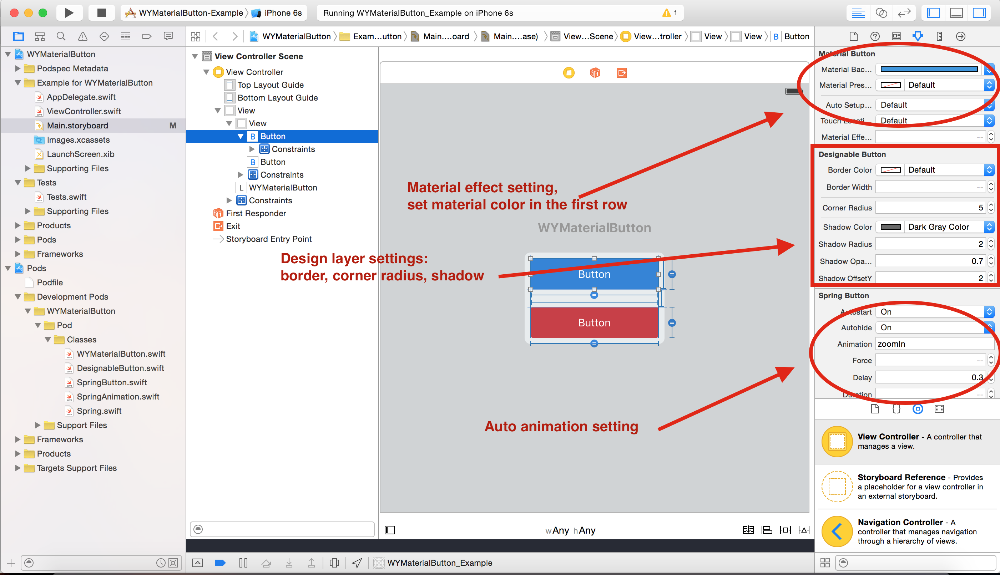

# WYMaterialButton

[](http://cocoapods.org/pods/WYMaterialButton)
[](http://cocoapods.org/pods/WYMaterialButton)
[](http://cocoapods.org/pods/WYMaterialButton)

#### Inspired by Google Material Design, written purely in Swift 2.0. 

WYMaterialButton implemented Material Design on iOS, allowing iOS buttons to be more responsive and interactive.

Integrated with [Spring](https://github.com/MengTo/Spring) animations, WYMaterialButton is super animated and programmer-friendly. All settings can be customized in storyboard inspector.


## Installation

#### WYMaterialButton is available through [CocoaPods](http://cocoapods.org).

To install it, simply add the following line to your Podfile:

```ruby
pod "WYMaterialButton"
```


#### Or download the git repository
```fish
git clone https://github.com/yuwang17/WYMaterialButton.git
```

Drag ``WYMaterialButton`` related files into your own project

Then import the module in your file
```swift
import WYMaterialButton
```

If you're Objective-C user, please include the header file
```swift
#import "WYMaterialButton-Swift.h"
```

## Usage
1) Add a ``UIButton`` in the Storyboard of your project.

2) Subclass the UIbutton as ``WYMaterialButton`` in identity inspector.

3) Select a color as ``Material Background Color``, the first row in attribute inspector, and let WYMaterialButton do everything else for you. You can do other setting as well.



## Specification
For most cases, ``Material Background Color`` is the only property you need to set. Leave others as default.

With ``Auto Setup Color`` enabled defautly, WYMaterialButton would set background of the button same as the ''materialBackgroundColor'', and set the text color to corresponding contrast color for maximing convenience for developers. If you wish the highest customization, just disable ``Auto Setup Color`` and set up the button as usual and won't hurt material effects.

With ``Touch Location Enable`` enabled defautly, WYMaterialButton would track your touch location and generate a ripple animation upon that. You can disable to center the ripple effect on the button.

``Material Effect Percent`` speicifies what percentage of area of the button will have material effect when being pressing. It default to 0.8.

You can of course access all these properties and more by using codes. For example:
```swift
myButton.materialBackgroundColor = UIColor.blueColor()
```


## Demo
1) Download the repository
```fish
git clone https://github.com/yuwang17/WYMaterialButton.git
cd WYMaterialButton/Example
```

2) Open the workspace
```fish
open WYMaterialButton.xcworkspace
```

3) Compile and run the app in simulator
* Under Xcode, press ``Ctrl + R``

## Requirements
* Xcode 7
* iOS 7

## Credits
[Spring](https://github.com/MengTo/Spring): subclass [@Mengto](https://twitter.com/MengTo)'s Spring framework for supporting additional animations and quick settings in the button.

[Material Design](https://www.google.com/design/spec/material-design/introduction.html): animation idea and effects come from Google's material design concept.

## LICENSE
WYMaterialButton is available under the [MIT License](LICENSE), see LICENSE for more infomation.
